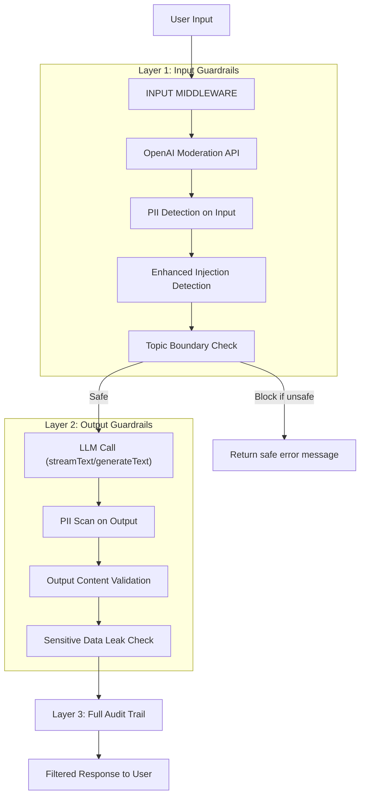

# AI Guardrails Architecture Plan

## Current State Assessment

Your current guardrails are **shallow and non-blocking**:

| Layer                             | Status                       | Problem                                                              |
| --------------------------------- | ---------------------------- | -------------------------------------------------------------------- |
| `validatePromptSafety`            | Logs only, does not block    | 12 regex patterns, trivially bypassable                              |
| `buildGuardRails` (system prompt) | Active                       | Relies on model compliance; easily circumvented via prompt injection |
| `buildBaseSecurityInstructions`   | **Dead code** - never called | Wasted effort                                                        |
| PII detection                     | Exists for recordings only   | Not applied to AI inputs/outputs (chat, summaries)                   |
| Output filtering                  | **None**                     | AI can leak PII, generate harmful content unchecked                  |
| OpenAI Moderation API             | **Not used**                 | Free API that catches hate, violence, self-harm, sexual content      |
| Audit logging                     | Logs user queries only       | AI responses are not logged for audit                                |

**System-prompt-only guardrails are insufficient for government-level safety.** The model can be coerced into ignoring system prompts through sophisticated injection attacks. You need programmatic, defense-in-depth guardrails that operate at the infrastructure level, independent of model compliance.

## Proposed Architecture: Defense in Depth



## Implementation Strategy

### Layer 1: Vercel AI SDK Middleware (Primary Mechanism)

The AI SDK middleware approach from the docs you shared is **exactly the right pattern** for your use case. It intercepts calls at the infrastructure level, wrapping around every `streamText`/`generateText` call uniformly.

Create a composable middleware stack in a new file `[apps/web/src/server/ai/middleware/](apps/web/src/server/ai/middleware/)` with these middlewares:

#### 1a. Input Moderation Middleware (`input-moderation.middleware.ts`)

- Uses `[transformParams](https://ai-sdk.dev/docs/ai-sdk-core/middleware)` to intercept every call before it reaches the model
- Calls the **OpenAI Moderation API** (`openai.moderations.create`) on the user message -- this is free and catches: hate, violence, self-harm, sexual content, harassment
- If flagged, **throws an error** that gets caught by your error handling, returning a safe message to the user
- This is the single highest-value addition: a free, battle-tested content filter

#### 1b. PII Input Guard Middleware (`pii-input-guard.middleware.ts`)

- Uses `transformParams` to scan user messages with your existing `PIIDetectionService`
- Redacts detected PII from the prompt before it reaches the model, or blocks and warns the user
- Reuses your existing service from `[apps/web/src/server/services/pii-detection.service.ts](apps/web/src/server/services/pii-detection.service.ts)` -- no new regex engine needed

#### 1c. Enhanced Prompt Injection Detection Middleware (`injection-guard.middleware.ts`)

- Replaces/extends the current `validatePromptSafety` with a **blocking** check
- Uses `transformParams` to reject requests that match injection patterns
- Upgrades the regex set with more sophisticated patterns (Unicode homoglyphs, base64 encoded instructions, multi-language injection vectors)
- Unlike the current implementation, this **blocks** the request rather than just logging

#### 1d. Topic Boundary Middleware (`topic-guard.middleware.ts`)

- Uses `transformParams` to ensure queries stay within the domain of the application (meeting recordings, project management)
- Adds a lightweight classification check: "Is this query about meetings/projects or is it trying to use the AI for something unrelated?"
- Can be implemented as a fast check against a deny-list of off-topic categories

### Layer 2: Output Guardrails Middleware

#### 2a. PII Output Filter Middleware (`pii-output-guard.middleware.ts`)

- Uses `wrapGenerate` and `wrapStream` to scan AI responses
- Runs `PIIDetectionService.detectPII()` on completed responses
- Redacts any PII the model may have generated (e.g., if RAG context contained un-redacted data)
- For streaming: buffers small chunks and scans, or scans the assembled text in `onFinish`

#### 2b. Output Content Validation Middleware (`output-validation.middleware.ts`)

- Uses `wrapGenerate` to run the OpenAI Moderation API on the **output** text
- Catches cases where the model generates harmful content despite safe input
- For streaming, runs as a post-stream check and flags for audit if problematic

### Layer 3: Audit and Observability

#### 3a. Audit Middleware (`audit.middleware.ts`)

- Uses `wrapGenerate`/`wrapStream` to log both input AND output to the `chat_audit_log` table
- Currently only user queries are logged -- AI responses need to be logged too for government compliance
- Logs: input text, output text, PII detections found, moderation flags, tokens used, model used, latency

### Middleware Composition

Create a factory in `[apps/web/src/server/ai/middleware/index.ts](apps/web/src/server/ai/middleware/index.ts)` that composes all middleware:

```typescript
import { wrapLanguageModel } from "ai";

export function createGuardedModel(
  model: LanguageModelV2,
  options: GuardrailOptions
) {
  return wrapLanguageModel({
    model,
    middleware: [
      createInputModerationMiddleware(),
      createPIIInputGuardMiddleware(options),
      createInjectionGuardMiddleware(),
      createTopicGuardMiddleware(),
      createPIIOutputGuardMiddleware(options),
      createOutputValidationMiddleware(),
      createAuditMiddleware(options),
    ],
  });
}
```

Then update `[apps/web/src/server/services/connection-pool.service.ts](apps/web/src/server/services/connection-pool.service.ts)` to return guarded models instead of raw models.

### Integration Points

These are the call sites that need updating to use the guarded model:

- `**streamText` calls in `[chat.service.ts](apps/web/src/server/services/chat.service.ts)` (3 methods: `generateResponse`, `streamResponse`, `streamOrganizationResponse`)
- **Raw `chat.completions.create` calls** in `[summary.service.ts](apps/web/src/server/services/summary.service.ts)`, `[task-extraction.service.ts](apps/web/src/server/services/task-extraction.service.ts)`, `[transcription.service.ts](apps/web/src/server/services/transcription.service.ts)`, `[conversation-context-manager.service.ts](apps/web/src/server/services/conversation-context-manager.service.ts)` -- these need to be migrated from raw OpenAI SDK to Vercel AI SDK `generateText` so middleware applies uniformly

### Additional Fixes

- **Activate dead code**: Wire up `buildBaseSecurityInstructions()` which is currently defined but never called in `[prompt-builder.service.ts](apps/web/src/server/services/prompt-builder.service.ts)`
- **RAG context uses original (un-redacted) transcription** for embeddings: Ensure the embedding pipeline uses `redactedTranscriptionText` when available, so PII never enters the vector store

## What NOT to Build

- **Custom ML-based content classifiers**: Overkill for now. The OpenAI Moderation API is free and covers the main categories. Revisit if you need domain-specific classification.
- **Real-time streaming token-by-token PII scanning**: Extremely complex, high false-positive rate. Scan assembled output instead.
- **Third-party guardrail services** (Lakera, Guardrails AI): Valid options but add vendor dependency and cost. The AI SDK middleware approach gives you equivalent capability with full control.

## Priority Order

1. **OpenAI Moderation API middleware** (input + output) -- highest value, free, 2-3 hours
2. **PII input/output guard middleware** -- reuses existing code, 2-3 hours
3. **Enhanced injection detection** (blocking) -- upgrades existing code, 1-2 hours
4. **Audit middleware** (log responses) -- compliance requirement, 1-2 hours
5. **Migrate raw OpenAI calls to AI SDK** -- enables middleware on all AI calls, 3-4 hours
6. **Topic boundary guard** -- nice-to-have, 1-2 hours
7. **RAG pipeline PII fix** -- use redacted text for embeddings, 1-2 hours

