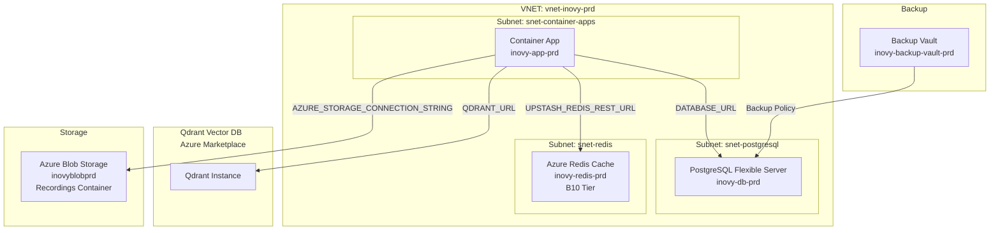
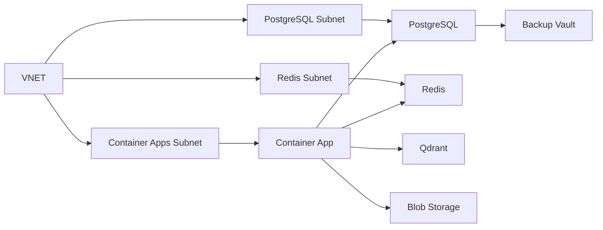

# Azure Infrastructure Deployment for Inovy Application

## Overview

This plan implements a complete Azure infrastructure deployment for the Inovy application using Terraform. The infrastructure includes Container Apps, PostgreSQL Flexible Server with backup, Azure Managed Redis, Qdrant Vector Database (Azure Marketplace), Azure Blob Storage, and VNET networking with dedicated subnets.

## Architecture

## Implementation Phases

### Phase 1: Network Infrastructure (VNET & Subnets)

**Estimate: 3 points**

Create VNET with dedicated subnets for Container Apps, PostgreSQL, and Redis following Azure best practices for network isolation.

**Files to create/modify:**

- `infrastructure/networking.tf` - VNET and subnet resources
- `infrastructure/variables.tf` - Add networking variables

**Resources:**

- Virtual Network (`vnet-inovy-<env>`)
- Subnet for Container Apps (`snet-container-apps`)
- Subnet for PostgreSQL (`snet-postgresql`)
- Subnet for Redis (`snet-redis`)
- Network Security Groups (NSGs) for each subnet

### Phase 2: PostgreSQL Flexible Server with Backup

**Estimate: 5 points**

Deploy PostgreSQL Flexible Server with private networking, backup vault, and backup policy configuration.

**Files to create/modify:**

- `infrastructure/database.tf` - PostgreSQL Flexible Server
- `infrastructure/backup.tf` - Backup Vault and policies
- `infrastructure/variables.tf` - Database configuration variables
- `infrastructure/outputs.tf` - Database connection strings

**Resources:**

- PostgreSQL Flexible Server (`inovy-db-<env>`)
- Database (`inovy`)
- Firewall rules (allow Azure services)
- Private DNS zone for PostgreSQL
- Backup Vault (`inovy-backup-vault-<env>`)
- Backup Policy (daily backups, 30-day retention)
- Backup Instance linking PostgreSQL to vault

**Configuration:**

- Version: PostgreSQL 15 or 16
- SKU: Standard tier (configurable)
- Storage: 128GB (configurable)
- High Availability: Enabled
- Private endpoint in dedicated subnet

### Phase 3: Azure Managed Redis Cache

**Estimate: 3 points**

Deploy Azure Managed Redis Cache (B10 tier) with VNET integration.

**Files to create/modify:**

- `infrastructure/redis.tf` - Redis Cache resource
- `infrastructure/outputs.tf` - Redis connection details

**Resources:**

- Redis Cache (`inovy-redis-<env>`)
- SKU: Basic B10 (1GB cache, non-SSL port)
- VNET integration in dedicated subnet
- Firewall rules

**Note:** Application uses `@upstash/redis` SDK which expects REST API. May need to configure Redis for REST access or update application code to use Azure Redis SDK.

### Phase 4: Qdrant Vector Database (Azure Marketplace)

**Estimate: 5 points**

Deploy Qdrant Vector Database from Azure Marketplace with proper configuration.

**Files to create/modify:**

- `infrastructure/qdrant.tf` - Qdrant Marketplace resource
- `infrastructure/outputs.tf` - Qdrant connection details

**Resources:**

- Qdrant instance from Azure Marketplace
- Configuration for API access
- Network integration (public endpoint or private endpoint)

**Considerations:**

- Qdrant Marketplace offering may have specific requirements
- May need to use Azure Container Instances or VM-based deployment
- API endpoint configuration for application access

### Phase 5: Azure Blob Storage

**Estimate: 3 points**

Create Azure Blob Storage account with container for recordings, configured for application access.

**Files to create/modify:**

- `infrastructure/storage.tf` - Blob Storage resources
- `infrastructure/outputs.tf` - Storage connection strings

**Resources:**

- Storage Account (`inovyblob<env>`)
- Container: `recordings`
- Access tier: Hot
- Public access: Disabled (private access via SAS tokens or managed identity)

### Phase 6: Container App Environment & Application

**Estimate: 8 points**

Deploy Container App Environment and Container App with proper networking, scaling, and environment configuration.

**Files to create/modify:**

- `infrastructure/container-app.tf` - Container App Environment and App
- `infrastructure/outputs.tf` - Container App URLs and endpoints

**Resources:**

- Container App Environment (`inovy-env-<env>`)
- Container App (`inovy-app-<env>`)
- Container Registry reference (ACR or Docker Hub)
- Ingress configuration (internal or external)
- Scaling configuration (min: 1, max: 3 replicas, 0.5-1 CPU, 1-2GB RAM)
- VNET integration (dedicated subnet)

**Configuration:**

- Runtime: Node.js 20.9+
- Port: 3000
- Health probes
- Environment variables from Terraform outputs
- Managed Identity for Azure service access

### Phase 7: Blob Storage Abstraction Layer

**Estimate: 8 points**

Create exchangeable blob storage system allowing Azure Blob Storage for Azure deployments and Vercel Blob for Vercel deployments.

**Files to create/modify:**

- `apps/web/src/lib/storage/blob-storage.ts` - Storage abstraction interface
- `apps/web/src/lib/storage/azure-blob-storage.ts` - Azure Blob Storage implementation
- `apps/web/src/lib/storage/vercel-blob-storage.ts` - Vercel Blob Storage implementation (refactor existing)
- `apps/web/src/lib/storage/index.ts` - Factory function to select storage provider
- `apps/web/src/actions/vercel-blob.ts` - Update to use abstraction
- `apps/web/src/lib/vercel-blob.ts` - Update to use abstraction
- `apps/web/src/features/recordings/actions/upload-recording.ts` - Update to use abstraction
- `apps/web/src/features/integrations/google/lib/google-drive-utils.ts` - Update uploadToBlob function

**Implementation:**

- Create `IBlobStorage` interface with methods: `upload`, `download`, `delete`, `getUrl`
- Implement Azure Blob Storage using `@azure/storage-blob` SDK
- Refactor existing Vercel Blob code into implementation class
- Factory function checks `BLOB_STORAGE_PROVIDER` env var (defaults to "vercel")
- Environment variable: `BLOB_STORAGE_PROVIDER=azure|vercel`
- Azure-specific env vars: `AZURE_STORAGE_ACCOUNT_NAME`, `AZURE_STORAGE_CONNECTION_STRING`, `AZURE_STORAGE_CONTAINER_NAME`

### Phase 8: Application Configuration Updates

**Estimate: 5 points**

Update application configuration to support Azure services and environment-specific settings.

**Files to create/modify:**

- `apps/web/src/server/db/index.ts` - Update PostgreSQL connection for Azure Flexible Server
- `apps/web/src/server/services/redis.service.ts` - Update for Azure Redis (may need SDK change)
- `apps/web/src/server/services/rag/qdrant.service.ts` - Verify Qdrant connection works with Azure Marketplace instance
- `apps/web/src/lib/auth.ts` - Update `BETTER_AUTH_URL` for Container App URL

**Environment Variables:**

- `DATABASE_URL` - PostgreSQL Flexible Server connection string
- `UPSTASH_REDIS_REST_URL` - Azure Redis REST endpoint (or update to Azure Redis SDK)
- `UPSTASH_REDIS_REST_TOKEN` - Azure Redis access key
- `QDRANT_URL` - Qdrant Azure Marketplace endpoint
- `QDRANT_API_KEY` - Qdrant API key
- `AZURE_STORAGE_ACCOUNT_NAME` - Blob storage account name
- `AZURE_STORAGE_CONNECTION_STRING` - Blob storage connection string
- `AZURE_STORAGE_CONTAINER_NAME` - Container name (default: "recordings")
- `BLOB_STORAGE_PROVIDER` - "azure" for Azure, "vercel" for Vercel

### Phase 9: Dockerfile & Container Configuration

**Estimate: 5 points**

Create Dockerfile for Next.js application optimized for Container Apps.

**Files to create:**

- `apps/web/Dockerfile` - Multi-stage Docker build
- `apps/web/.dockerignore` - Docker ignore patterns
- `infrastructure/container-app.tf` - Container image configuration

**Dockerfile Requirements:**

- Multi-stage build (builder + runner)
- Node.js 20.9+ base image
- Install dependencies with pnpm
- Build Next.js application
- Run production server (`next start`)
- Health check endpoint
- Non-root user
- Optimized layer caching

### Phase 10: Terraform Variables & Outputs

**Estimate: 3 points**

Complete Terraform configuration with all variables, outputs, and data sources.

**Files to create/modify:**

- `infrastructure/variables.tf` - All infrastructure variables
- `infrastructure/outputs.tf` - All resource outputs (connection strings, URLs, etc.)
- `infrastructure/data.tf` - Data sources (if needed)
- `infrastructure/main.tf` - Provider configuration (already exists)

**Key Outputs:**

- Database connection string
- Redis connection details
- Qdrant endpoint and API key
- Blob storage connection string
- Container App URL
- Resource group name

### Phase 11: GitHub Actions Workflow Updates

**Estimate: 3 points**

Update GitHub Actions workflow to deploy container image and configure Container App.

**Files to create/modify:**

- `.github/workflows/azure-infra.yml` - Add container build and deployment steps
- `.github/workflows/azure-container-deploy.yml` - New workflow for container deployment (optional)

**Workflow Steps:**

- Build Docker image
- Push to Azure Container Registry (or Docker Hub)
- Update Container App with new image
- Set environment variables from Terraform outputs
- Health check verification

### Phase 12: Documentation & Testing

**Estimate: 5 points**

Create deployment documentation and test infrastructure deployment.

**Files to create/modify:**

- `infrastructure/DEPLOYMENT.md` - Deployment guide
- `infrastructure/README.md` - Update with new resources
- `infrastructure/WORKFLOWS.md` - Update with deployment process

**Testing:**

- Terraform plan validation
- Infrastructure deployment test
- Application connectivity test
- Storage upload/download test
- Database migration test

## Resource Naming Convention

All resources follow pattern: `{resource-type}-inovy-{environment}` or `inovy{resource-type}{env}`

Examples:

- Resource Group: `rg-inovy-prd`
- VNET: `vnet-inovy-prd`
- PostgreSQL: `inovy-db-prd`
- Redis: `inovy-redis-prd`
- Container App: `inovy-app-prd`
- Storage Account: `inovyblobprd`

## Dependencies

## Security Considerations

- All resources in private subnets where possible
- Private endpoints for PostgreSQL and Redis
- Managed Identity for Container App to access Azure services
- Storage account with private access (no public blobs)
- Network Security Groups restricting traffic
- TLS/SSL for all connections

## Estimated Total Effort

**Total Story Points: 52 points**

Breakdown:

- Infrastructure: 24 points (Phases 1-6)
- Application Code: 13 points (Phases 7-8)
- Container & Deployment: 8 points (Phases 9-11)
- Documentation & Testing: 5 points (Phase 12)

**Estimated Timeline: 6-8 weeks** (assuming 1 developer, 8-10 points per week)