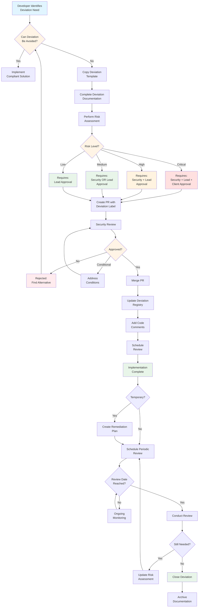
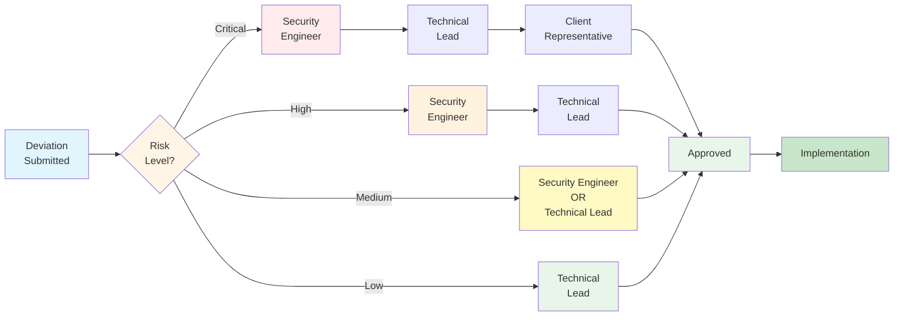
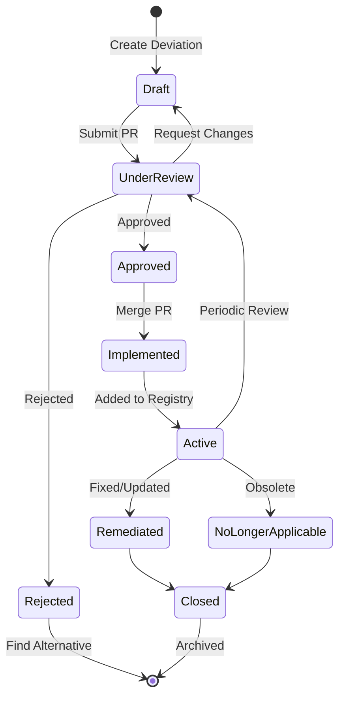
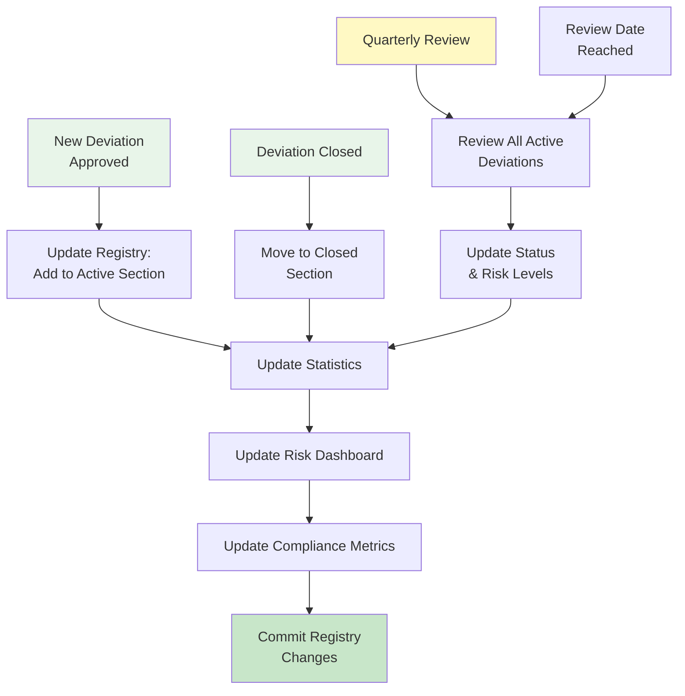
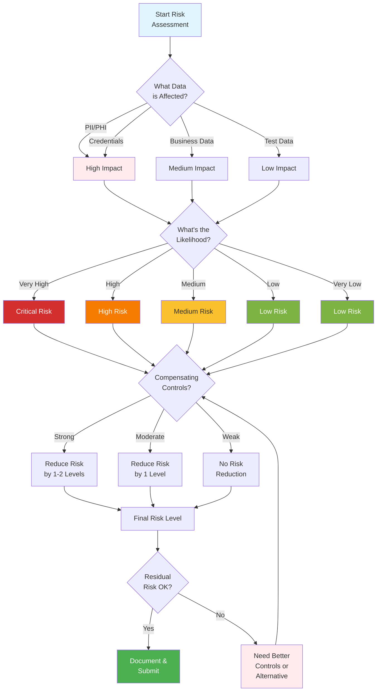

# Hardening Deviation Process Flowchart

**Visual Guide to the Hardening Deviation Process**

## Complete Process Flow

## Risk-Based Approval Workflow

## Deviation Lifecycle

## Registry Update Flow

## Risk Assessment Decision Tree

## Usage Guide

### For Developers

1. Start at **Complete Process Flow** to understand end-to-end process
2. Use **Risk Assessment Decision Tree** to determine risk level
3. Follow **Risk-Based Approval Workflow** to get required approvals

### For Security Reviewers

1. Use **Deviation Lifecycle** to track status
2. Reference **Risk-Based Approval Workflow** for approval requirements
3. Follow **Registry Update Flow** to update tracking

### For Auditors

- **Deviation Lifecycle** shows governance process
- **Registry Update Flow** demonstrates tracking
- **Risk Assessment Decision Tree** shows risk methodology

---

## Interactive Version

For an interactive version of these diagrams:

1. View this file in a Markdown viewer with Mermaid support
2. Use GitHub's Mermaid rendering
3. Use Mermaid Live Editor: https://mermaid.live/

---

**Flowcharts Version:** 1.0  
**Last Updated:** 2026-02-24  
**See Also:** [HARDENING_DEVIATION_PROCESS.md](./HARDENING_DEVIATION_PROCESS.md)
